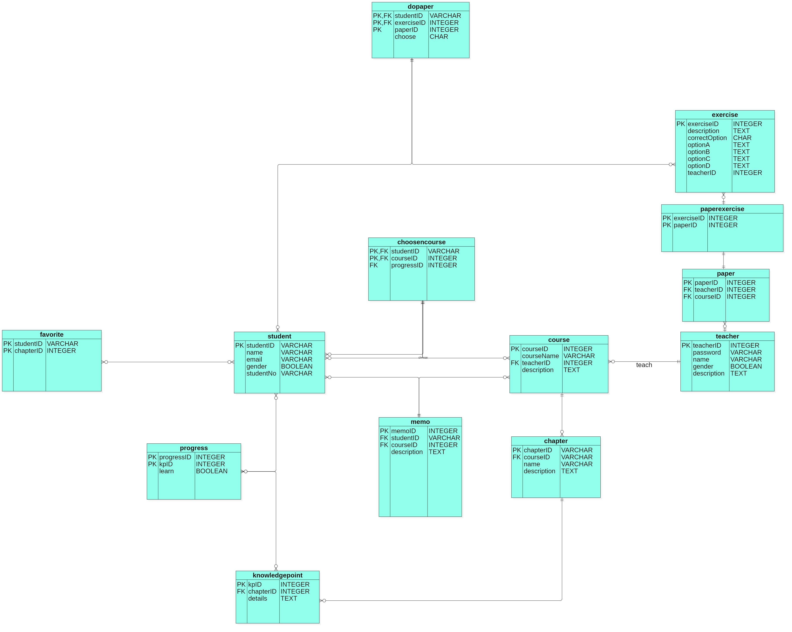

## 上一次修改时间 2019/6/3

- 创建数据库
- 利用MyBatis生成初始化的dao，entity，mappering文件

### ER图解

####student
- studentID	 	
	- **varchar**	   
	- 微信号取得的id 
	- 主键
- name	        
	- **varchar**	   
	- 学生姓名非空
- email		    
	- **varchar**	   
	- 电子邮箱可以为空
- gender		
	- **Boolean**	   
	- 性别，0为男，1为女
- studentNo		
	- **varchar**    
	- 学生学号，可为空

当一个新的学生用户添加进时，需要按照以上添加，id，name，gender不能为空

####teacher
- teacherID	  
	-  **int**
	-  自动增加的整数型，老师的id
- password
	- varchar
	- 密码，不能为空
- name
	- varchar
	- 老师姓名，不能为空
- gender
	- Boolean
	- 老师性别，0为男，1为女，不能为空
- description
	- text
	- 对老师的描述，可为空

当添加老师时，以上不能为空的必须填入

####course
- courseID
	- int
	- 课程的id，整数自增
	- 主键
- courseName
	- varchar
	- 课程名字，非空
- teacherID
	- int
	- 教师id，来自teacher，非空
- description
	- varchar
	- 对课程的描述，可为空

当添加课程时，老师的id必须传入添加

####chapter
- chapterID
	- int
	- 自增整数，章节的id
	- 主键
- courseID
	- int
	- 来自course，表示该章节属于该课程
- name
	- varchar
	- 该章节名称，非空
- description
	- text
	- 对章节的描述，最好不为空

添加章节时，因为是老师创建，所以对应的课程id应该传入

####knowledgepoint
- kpID
	- int
	- 知识点id，自增整数
	- 主键
- chapterID
	- int
	- 来自chapter，表示该知识点属于哪一个章节
- details
	- text
	- 对知识点的描述，最好不为空

添加知识点，需要传入来自哪一个章节

####progress
- progressID
	- int
	- 进程id
	- 主键
- kpID
	- int
	- 知识点id，来自knowledgepoint
	- 主键
- learn
	- Boolean
	- 是否已学，0为未学，1为已学
该表表示，进度完成情况，就是一个进程里有多个知识点，每个知识点都会记录是否已经学习了

####memo
- memoID
	- int
	- 笔记id
	- 主键
- studentID
	- varchar
	- 学生号，表示谁记录该笔记，来自student
- courseID
	- int
	- 课程id，表示哪个课程的笔记，来自course
- description
	- text
	- 具体的笔记内容
笔记的表，以章节课程为单位

####choosecourse
- studentID
	- varchar
	- 学生id，来自student
	- 主键
- courseID
	- int
	- 课程id，来自course
	- 主键
- progressID
	- int
	- 进程id，来自progress

因为一个学生可以选择多门课程，一门课程可以被多个学生选择，但一个学生与一门课程只会有一个进度

####favorite
- studentID
	- varchar
	- 学生id，来自student
	- 主键
- chapterID
	- int
	- 章节id，来自chapter
	- 主键
收藏是以章节为单位，一个学生对应一个章节的收藏与否

####paper
- paperID
	- int
	- 自增整数，老师创建的小测
	- 主键
- teacherID
	- int
	- 创建的教师id，谁创建，来自teacher
- courseID
	- int
	- 哪个课程上的paper，来自course
这样划分是为了能够区分哪个课程创建了小测

####paperexercise
- exerciseID
	- int
	- 试题id，来自exercise
	- 主键
- paperID
	- int
	- 试卷id，来自paper
	- 主键
	
可以通过试题组装一个测验

####exercise
- exerciseID
	- int
	- 自增整数，题目的id
	- 主键
- description
	- text
	- 题目的描述，非空
- correctOption
	- char
	- 正确选项
- optionA
	- text
	- A选项内容
- optionB
	- text
	- B选项内容
- optionC
	- text
	- C选项的内容
- optionD
	- text
	- D选项的内容
- teacherID
	- int
	- 谁创建的该题，来自teacher

####dopaper
- studentID
	- varchar
	- 谁做的，来自student
	- 主键
- exerciseID
	- int
	- 哪个题，来自exercise
	- 主键
- paperID
	- int
	- 那张试卷的
	- 主键
- choose
	- char
	- 所选的

考虑到有可能在不同的课程做过相同的题

---

目前的所建的表就是以上的了，我自现在也有一点懵逼了，写的过程中感觉到问题了，你们仔细看看，提出问题修改

修改的文件

- application.poperties 变成了 application.yml
- 向修改后的application.yml添加数据，主要是数据库的配置
	- 注意，我的数据库的用户名和密码和大家的可能不一样
- pom.xml
	- 修改的内容包括添加了连接池，druid
	- 添加了一个mybatis的插件，可以不用在意
- 在resources文件夹下添加文件
	- database
		- education.sql 数据库文件
	- mybatis
		- generatorConfig.xml文件是配置mybatis的，可以不用在意
	- mapping文件夹，自动生成的
- 其他自动生成的
	- dao 文件夹，数据访问层，做映射与mapping文件夹
	- entity 文件夹，实体集对应的Java对象

其中那些自动生成的后面会根据实际的事务添加新的

sql文件一再resources/database/中
